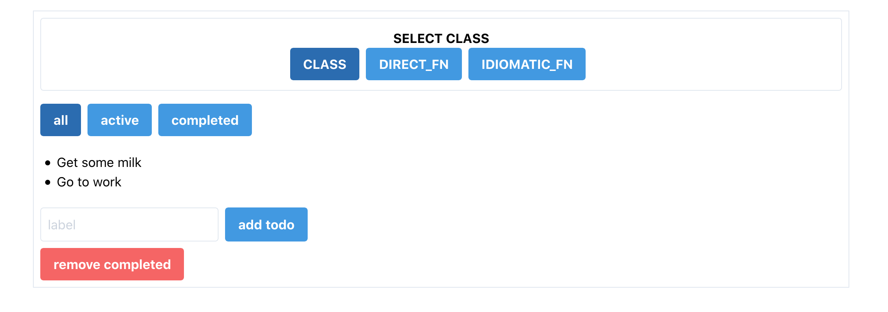

I wanted to do some comparisons of different styles of React components so I could understand differences between them as they change.

I have 3.

1. The class component as I think it would appear
2. The function component converted directly from a class component
3. The function component created with

The sample app is a boring todo list example

